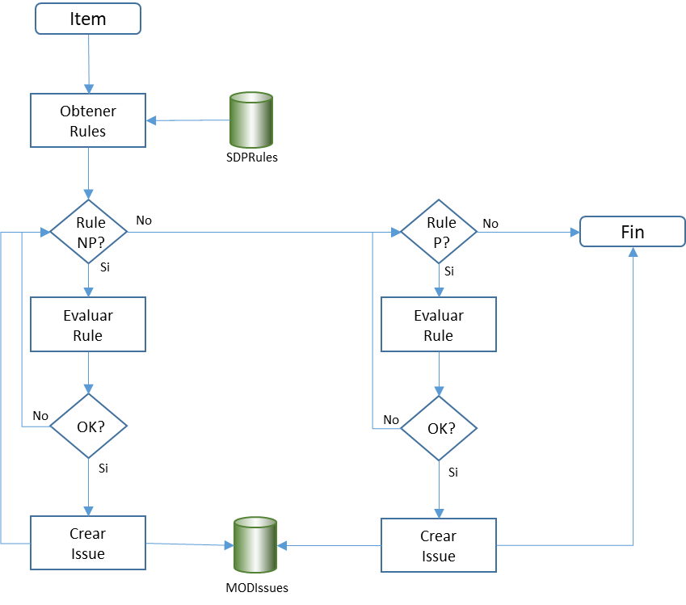

**ÍNDICE**

1 Configuración 5

1.1 Cygwin 5

1.2 MySQL 5

1.3 postgreSQL 5

2 SDPAnalyzer 12

2.1 Flujo en local 12

3 Pendiente o no soportado 13

3.1 RENAMES 13

4 Linea de comandos 14

5 Reglas 16

5.1 Estructura de las reglas 16

5.2 Tipos de reglas 17

5.3 Condiciones de activación 17

5.4 lvalues 18

5.4.1 property 18

5.4.2 type 18

5.4.3 attribute 19

5.4.4 method 19

5.4.5 expression 19

5.4.6 script 19

5.5 operator 20

5.6 rvalues 20

6 IVP 21

6.1 Caso basico 21

**Índice de tablas, diagramas e ilustraciones**

Diagrama 1: Arbol de reglas 16

Diagrama 2: Flujo de evaluación de reglas 17

Código 1: Ejemplo de codificación legible 9

**No se encuentran elementos de tabla de ilustraciones.**

**No se encuentran elementos de tabla de ilustraciones.**

Configuración
=============

Cygwin
------

Instalar la versión de 32 bits, por que falla la instalación de OpenCobol si no

Establecer las variables de entorno en .bash_profile

export PATH=/cygdrive/p/SDP/bin:\$PATH

export COB_COPY_DIR=/cygdrive/p/SDP/Cobol/CPY01

export COBCPY=/cygdrive/p/SDP/Cobol/CPY01

export COB_LIBRARY_PATH=/cygdrive/p/SDP/Cobol/LIB

Desinstalar:

This command takes ownership recursive of the folder, without asking anything:

takeown /r /d y /f cygwin

This command gives Full Access to Everyone recursively in the folder:

icacls cygwin /t /grant Everyone:F

And finally, the command which deletes it all and removes Cygwin:

rmdir /s /q cygwin

MySQL
-----

| Componente | Descripción                        |
|------------|------------------------------------|
|            |                                    |
| Directorio | E:\\Servers\\MySQL Datos en C:\\DB |
|            |                                    |
| Usuarios   | root:mysql                         |
|            |                                    |

postgreSQL
----------

| Componente | Descripción                        |
|------------|------------------------------------|
|            |                                    |
| Directorio | E:\\Servers\\MySQL Datos en C:\\DB |
|            |                                    |
| Usuarios   | Root:postgresql                    |
|            |                                    |

Pendiente o no soportado
========================

Bloques de Comentarios
----------------------

Tenemos que distinguir entre comentarios aislados y bloques de comentarios. Para
ello tenemos que mantener la secuencia de comentarios conjuntos, lo que obliga a
mantener la traza del ultimo símbolo procesado.

No es conveniente gestionar los comentarios en la parte sintáctica por que puede
haber comentarios entre las sentencias y eso nos obliga a controlarlos en todas
las construcciones.

### Enfoque

**Puede ser mas fácil chequear si esta entre una sentencia y pasárselo al CUP**

Para no rehacer todo el proceso, en ParserInfo guardamos, como se hace hasta
ahora para el tema COPYs el ultimo símbolo procesado.

Al tener que capturar el bloque de comentarios es necesario que a veces no se
devuelva ningún símbolo: Este es el caso en el que trato un comentario y el
siguiente símbolo es otro comentario en la siguiente línea, como en el momento
que proceso la primera línea, no se cual es la segunda, no puedo devolver ese
comentario, asi que devuelvo NULL, si el siguiente símbolo no es un comentario,
devuelvo el comentario anterior y me guardo el símbolo.

RENAMES
-------

Pendiente de implementar

Hay que considerar el RENAMES THRU

SDPTrapper

SDPAnalyzer

SDPAnalyzer
===========

Flujo en local
--------------

Aunque SDPAnalyzer se arrancará a través del Collector, en modo local podríamos
primero guardar el fichero y luego realizar el análisis, pero en ese caso
tendríamos que arrancar la transacción al inicio y luego habría que guardar las
COPYS y demás ficheros.

Por eso, los ficheros se guardan al final si el arranque es en local.

Y se deben guardar siempre, independientemente del resultado del analisis

Linea de comandos
=================

Los parámetros de los componentes que pueden ejecutarse de la línea de comandos
se comportan de la misma manera:

Cada componente implementa una clase estática que define la tabla de parámetros
aceptados de acuerdo con la siguiente estructura:

| Orden | Nombre   | Descripción                                                                                                                                                                                                                                                                                           |
|-------|----------|-------------------------------------------------------------------------------------------------------------------------------------------------------------------------------------------------------------------------------------------------------------------------------------------------------|
|       |          |                                                                                                                                                                                                                                                                                                       |
| 1     | Corto    | Especifica la clave del parámetro corto (Estilo BSD: un guión)                                                                                                                                                                                                                                        |
|       |          |                                                                                                                                                                                                                                                                                                       |
| 2     | Largo    | Especifica la clave del parámetro largo (Estilo Linux: dos guiones)                                                                                                                                                                                                                                   |
|       |          |                                                                                                                                                                                                                                                                                                       |
| 3     | Entorno  | Especifica la variable de entorno asociada                                                                                                                                                                                                                                                            |
|       |          |                                                                                                                                                                                                                                                                                                       |
| 4     | Variable | Indica la variable de configuración utilizada                                                                                                                                                                                                                                                         |
|       |          |                                                                                                                                                                                                                                                                                                       |
| 5     | Tipo     | Indica el tipo de dato de la variable de acuerdo con la clase Args                                                                                                                                                                                                                                    |
|       |          |                                                                                                                                                                                                                                                                                                       |
| 6     | Texto    | Indica el código de mensaje de la opción (Numérico)                                                                                                                                                                                                                                                   |
|       |          |                                                                                                                                                                                                                                                                                                       |
| 7     | Defecto  | 1 – Si es el valor por defecto                                                                                                                                                                                                                                                                        |
|       |          |                                                                                                                                                                                                                                                                                                       |
| 8     | Grupo    | Si existe y es mayor de 100, distinto de 0, agrupa opciones excluyentes en múltiplos de 100. Ejemplo: 101 – Indica grupo 1 e identifica la opción como 1 102 – Indica grupo 1 e identifica la opción como 2                                                                                           |
|       |          |                                                                                                                                                                                                                                                                                                       |
| 9     | Subgrupo | Si se ha especificado una agrupación y es mayor de 99 indica que los parámetros se asocian a la opción del grupo indicado con el mismo tratamiento que grupo. Ejemplo: 201 y X 201 y Y Indica que los parámetros X e Y se aplican si se ha indicado el parámetro 102 y que son incompatibles entre sí |
|       |          |                                                                                                                                                                                                                                                                                                       |
| 10    | Valores  | Lista de valores aceptados separados por punto y coma                                                                                                                                                                                                                                                 |
|       |          |                                                                                                                                                                                                                                                                                                       |

Reglas

Reglas
======

Dada la importancia de las reglas de calidad estas se detallan en un apartado
propio.

Estructura de las reglas
------------------------

Las reglas se estructuran a través de un árbol jerárquico y de los siguientes
conceptos:

-   **Root**: Es el nodo raíz de todas las reglas

-   **Group**: Es un nodo de agrupación de reglas, definido para facilitar la
    gestión y administración de las mismas. Un Group está formado por un
    conjunto de nodos Item y a su vez, un conjunto opcional de nodos Group.

-   **Item**: Identifica el objeto sobre el que se va aplicar la regla. Este
    objeto representa una abstracción de un componente de un programa, por
    ejemplo: “Statement” referencia a cualquier sentencia COBOL; “Block”
    referencia un conjunto de sentencias. Un Item agrupa el conjunto de nodos
    Rule que se deben evaluar sobre ese objeto.

-   **Rule**: Define la regla del control de calidad que se debe satisfacer así
    como su implementación. Distinguimos dos tipos de objeto Rule:

    -   **Rule NP**: Regla no prioritaria. Cada uno de estos nodos, si existen,
        se evalúa sobre el objeto especificado independientemente del número y
        estado de nodos Rule NP ya evaluados. El orden de ejecución de este tipo
        de nodos no está definido y permite que un determinado objeto tenga
        múltiples issues.

    -   **Rule P**: Regla prioritaria. Estos nodos, si existen, se evalúan de
        manera secuencial por orden ascendente de prioridad hasta que se recorre
        toda la cadena de prioridades o se satisface la condición especificada
        en el nodo.

Diagrama 1: Arbol de reglas

El acceso a las reglas se realiza en el momento que se dispone de un objeto a
evaluar y los diferentes controles a aplicar se realizan, como se ha explicado
en función del tipo de nodos Rule definidos para ese Objeto de acuerdo con el
siguiente flujo de proceso:

Diagrama 2: Flujo de evaluación de reglas

Tipos de reglas
---------------

Básicamente hay los siguientes tipos de reglas:

1.  No permitido. Es decir, una determinada sentencia o cosa, no se puede
    utilizar. Por ejemplo, las directivas del compilador

2.  Obligatorio. Una sentencia que se debe especificar. Esto aplica básicamente
    a identification division o a comentarios en párrafos.

3.  Reglas de control. Estas varían en función de las cosas

Condiciones de activación
-------------------------

De manera general la condición se activa cuando la aplicación de la siguiente
formula genérica se evalúa a cierto:

lvalue operator rvalue

lvalues
-------

Un lvalue es una abstracción que define una posible acción a realizar sobre el
objeto que está siendo evaluado, puede ser uno de los siguientes:

-   property

-   type

-   attribute

-   method

-   expression

-   script

### property

Una propiedad es un atributo que es satisfecha por un determinado objeto.

Indica que se debe verificar si el objeto evaluado posee la propiedad indicado.
El resultado de la evaluación siempre es un valor lógico.

Ejemplo:

\<r:item name=*"Inline"*\>

\<object\>PARAGRAPH\</object\>

\<activateOnCondition\>

\<property\>isInline\</property\>

\</activateOnCondition\>

….

\</r:item\>

Indica que el grupo de reglas asociados al ítem “Inline” se activará si el
objeto PARAGRAPH satisface la propiedad isInLine.

### type

Indica que se haga una operación de casting sobre el objeto para obtener un
objeto de un tipo específico. Sus valores posibles son:

| Type   | Objeto                                         |
|--------|------------------------------------------------|
|        |                                                |
| String | Cadena de caracteres                           |
|        |                                                |
| Verb   | Sentencia COBOL                                |
|        |                                                |
| Option | Opción de una sentencia COBOL                  |
|        |                                                |
| lvalue | LValue de una sentencia COBOL                  |
|        |                                                |
| rvalue | RValue de una sentencia COBOL                  |
|        |                                                |
| value  | Se identifica el objeto en función de su valor |

Ejemplo:

\<condition negated=*"true"*\>

\<type\>string\</type\>

\<operator\>start\</operator\>

\<rvalue\>\*\</rvalue\>

Indica que el objeto evaluado (en este caso una línea de comentarios) se debe
considerar como una cadena y debe iniciarse con el carácter asterisco (\*)

### attribute

Un atributo se entiende como una propiedad de un objeto que puede no ser lógica.

Ejemplo:

\<r:item name=*"Inline"*\>

\<object\>PARAGRAPH\</object\>

\<r:rule\>

\<severity\>3\</severity\>

\<r:description\>

\<text lang=*"xx"*\>*Lineas del parrafo*\</text\>

\</r:description\>

\<condition\>

\<attribute\>numLines\</attribute\>

\<operator\>gt\</operator\>

\<rvalue\>10\</rvalue\>

\</condition\>

\</r:rule\>

….

\</r:item\>

Especifica que la regla se activará si el atributo “numLines” del objeto
PARAGRAPH evaluado es superior al valor 10.

| Type   | Objeto                                        |
|--------|-----------------------------------------------|
|        |                                               |
| string | Cadena de caracteres                          |
|        |                                               |
| Verb   | Sentencia COBOL                               |
|        |                                               |
| Option | Opción de una sentencia COBOL                 |
|        |                                               |
| lvalue | LValue de una sentencia COBOL                 |
|        |                                               |
| rvalue | RValue de una sentencia COBOL                 |
|        |                                               |
| value  | Se identificael objeto en función de su valor |

### method

Indica que se debe aplicar como lvalue el resultado de ejecutar el método
indicado sobre el objeto que está siendo evaluado

### expression

Indica que se debe aplicar como lvalue el resultado de ejecutar la expresión
indicada

### script

Cuando en lugar de una expresión simple, es necesario un conjunto de expresiones
ejecutadas de manera secuencial, entonces se trata de un script.

operator
--------

Indica el tipo de operación lógica que se debe aplicar a los dos operadores y
cuyo resultado, cuando se evalúa a cierto, provoca la activación de la
condición.

La lista de operadores es:

| Operador  | Operación                 |
|-----------|---------------------------|
|           |                           |
| mandatory | El objeto debe existir.   |
|           |                           |
| equal     | LValue == RValue          |
|           |                           |
| eq        | LValue == RValue          |
|           |                           |
| is        | LValue instanceOf RValue  |
|           |                           |
| gt        | LValue \> RValue          |
|           |                           |
| lt        | LValue \< RValue          |
|           |                           |
| ge        | LValue \>= RValue         |
|           |                           |
| Le        | LValue \<= RValue         |
|           |                           |
| start     | LValue.startsWith(RValue) |
|           |                           |
| end       | LValue.ensWith(RValue)    |
|           |                           |
| contains  | LValue.contains(RValue)   |
|           |                           |
| match     | LValue.matches(RValue)    |
|           |                           |

rvalues
-------

Se comportan igual que los lvalues

IVP
===

Cuando hemos cogido cada programa de IVP, nos guardamos si tiene mas de un juego
de pruebas.

Cuando acabe el primer ciclo, empezamos con los siguientes, de esta forma no
vamos cargando y descargando tablas.

Hay que considerar que hay diferentes programas. ¿Agrupar por ellos?

Caso basico
-----------

La manera mas simple es incluir los resultados del IVP en el propio programa.
Aquí no necesitamos generalización por que es para uso interno.

\*\> SDP IVP bloque objeto.método operador valor - desc

\*\> Para indicar que es un comentario especial

SDP para indicar que es del producto

IVP para indicar que es un caso de IVP

Bloque si existe, indica que hay varios casos de uso

Objeto clase que hay que investigar

Método método que hay que invocar

Valor valor esperado

Caso_uso buscar un script que se llame igual y lo ejecutará antes de empezar

No enviamos datos al server

Si cuando test guardamos siempre el mismo usuario y las mismas fechas, se puede
calcular el md5 y verificar los datos

Podemos coger el texto a sacar de SDPDesc

Necesito una lista de los programas y sus md5

En el proyecto de test o de prueba meter un parámetro para que cargue lo que ya
hay chequeado y genere el nuevo en el mismo fichero: las firmas, el nombre, etc
….
